# 文档模板

docusaurus官方文档：https://docusaurus.io/docs

## 部署项目到vercel

一、创建本地项目并提交到github

二、git登录vercel首页Create a New Project

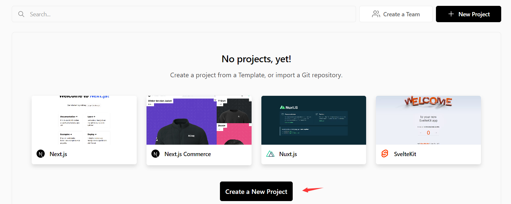

三、查找项目并Import

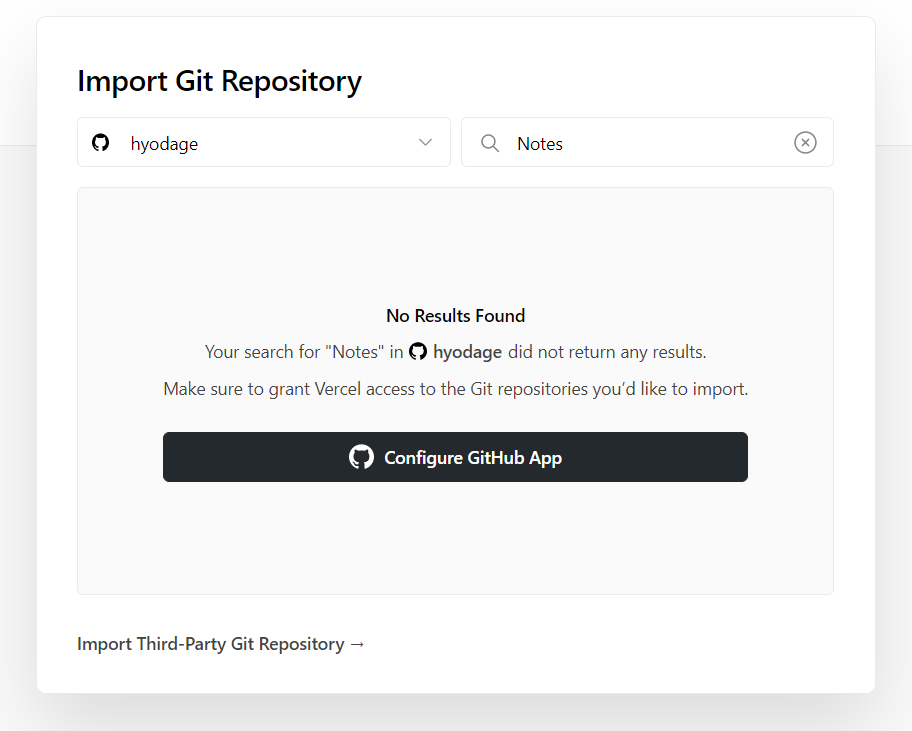

四、授权

可能无法查找到项目，点击configure Github App进入github授权

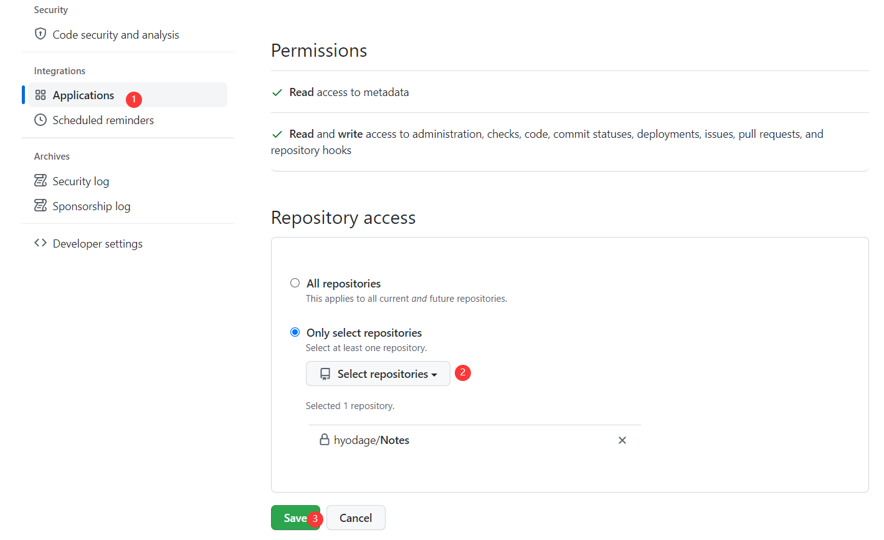

五、导入项目

授权后进入页面，点击Import导入项目

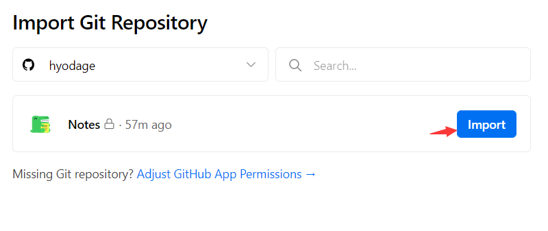

六、部署

直接Deploy部署

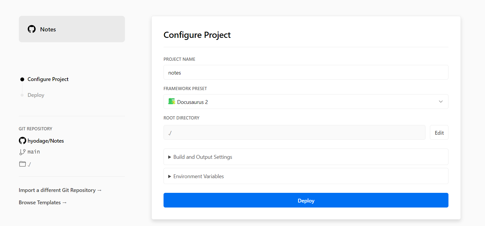

七、部署完成

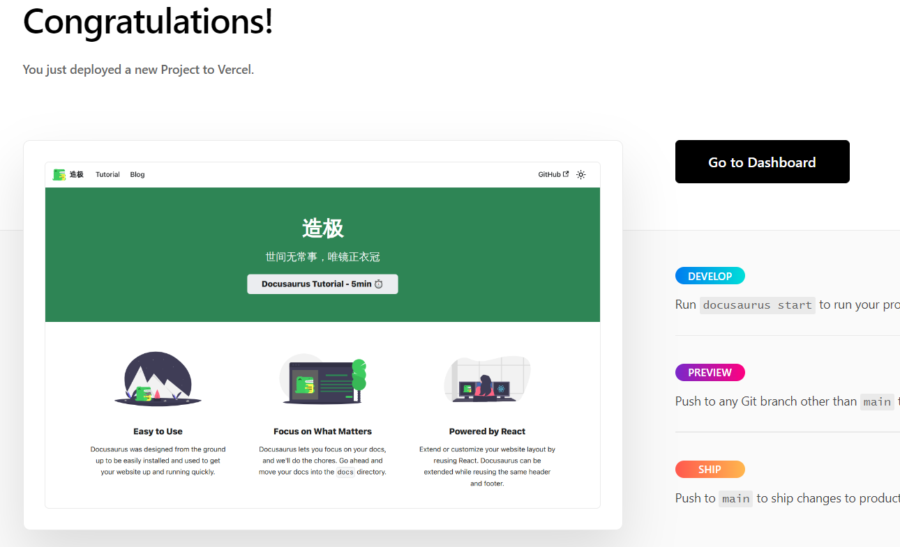

点击图片访问站点，随后可点击Dashboard进入工作台进行其他配置

## 配置自定义域名

进入项目设置

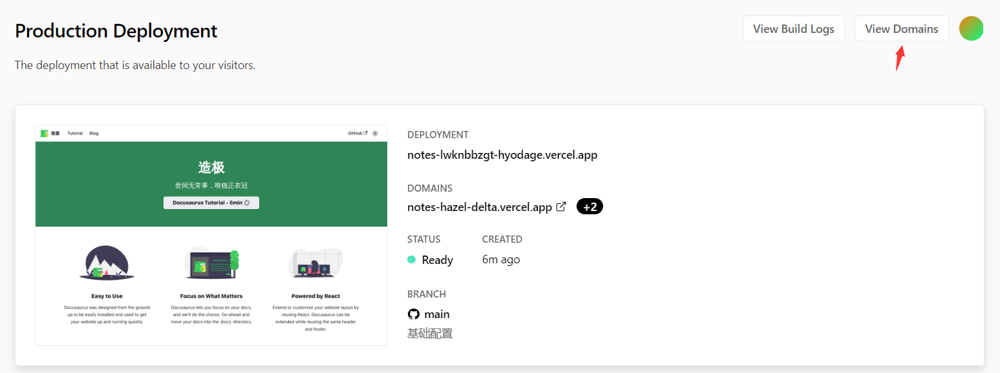

添加自己的domains，不添加使用vercel默认分配的地址

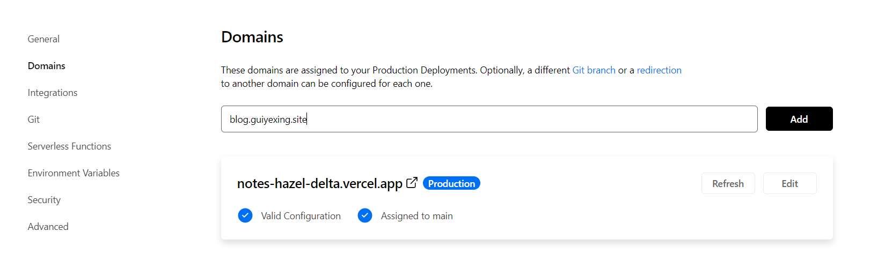

提示如下

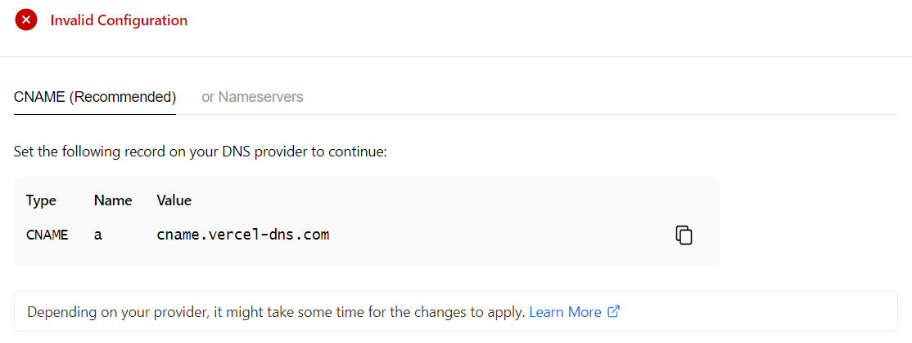

在自己的域名管理中添加如下记录


添加成功，显示如下

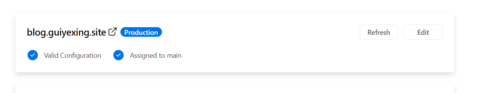

访问地址

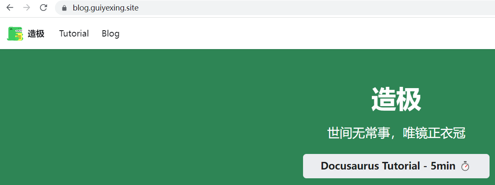

## 本地开发参考

### blog

Use a `<!--` `truncate` `-->` comment to limit blog post size in the list view.

博客内位于其后的内容在/blog下使用`read more`定位到具体位置查看详情

默认10条记录分页，可通过postsPerPage配置显示全部或其他条数来分页

### docs

docs新增目录结构如下

```
Notes
├── docs
│   ├── deploy
│   │   ├── img
│   │   ├── _category_.json
│   │   └── 01-docusaurus.md
```

deploy目录将写有关打包部署的文档

`_category_.json`配置侧边栏信息

```json title="_category_.json"
{
  "label": "部署",
  "position": 0,
  "link": {
    "type": "generated-index"
  }
}
```

01-数字标识仅用于本地开发排序，不会作为展示，且支持多种格式

`01-docusaurus.md`中可以引用img中的图片，建议直接定义1级标题，否则会以文件名为标题

```markdown
---
sidebar_position: 0
---

# 文档模板

...
```

在`docusaurus.config.js`中themeConfig.navbar.items下类型为'doc'的配置项里

配置docId的默认地址，如下：

`docId: '/category/部署'`
