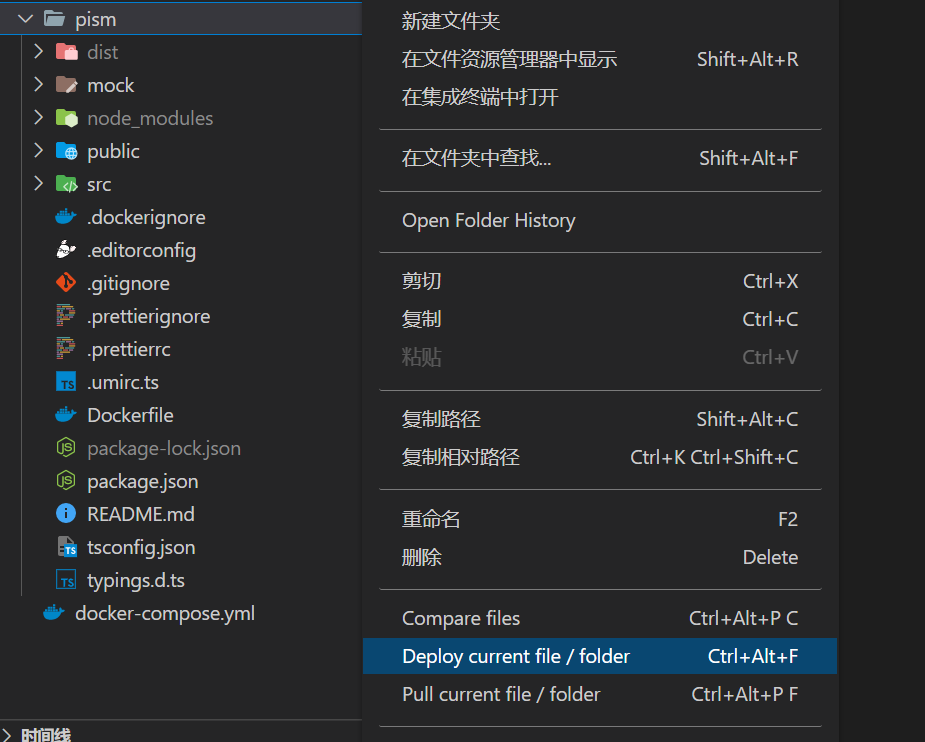
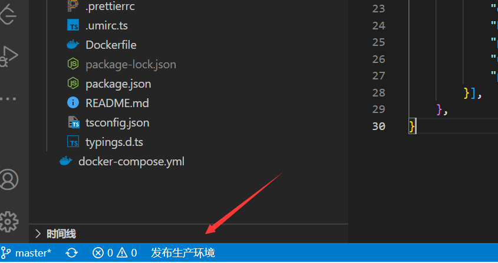

# vscode同步文件到服务器

VSCode安装插件Deploy


根目录配置.vscode/settings.json

```json
{
    "deploy": {
        "packages": [{
            "files": [
                "**/*",
            ],
            "exclude": [
                "node_modules/**",
                ".git/**",
                ".vscode/**",
                "**/node_modules/**",
            ],
            "deployOnSave": false,
            "button": {
                "text": "发布生产环境",
                "tooltip": "点击发布到生产环境...",
                "targets": [ "TXServer" ]
            }
        }],
        "targets": [{
            "type": "sftp",
            "name": "TXServer",
            "dir": "/home/ubuntu/app/pism-web",
            "host": "101.43.181.81",
            "port": 22,
            "user": "ubuntu",
            "privateKey": "D:\\server\\CI"
        }],
    },
}
```

秘钥保存到了`D:\\server\\CI`，获取秘钥[参考](/docs/deploy/CICD持续集成)

deployOnSave设置为false可以取消保存后自动同时，使用手动同步方式，使用Deploy current file / folder推送文件或文件夹



不可以使用以上方式同步带有需要过滤的文件，如直接对根文件进行Deploy时node_modules无法过滤掉，也会同步到服务器

需要过滤生效使用以下方式同步所有



