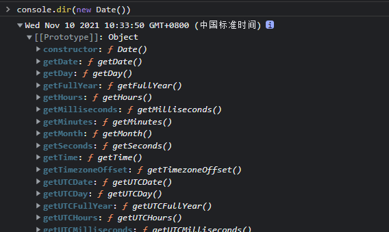
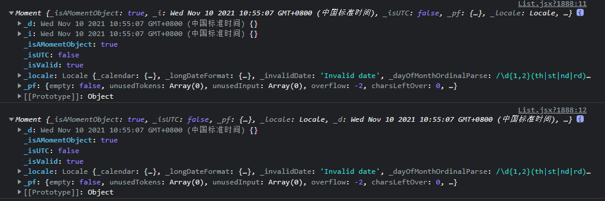

# 时间处理

## new Date()

```js
let now = new Date()
console.log(now) // Wed Nov 10 2021 10:33:10 GMT+0800 (中国标准时间)
console.log(typeof new Date()) // 'ojbject'
console.dir(new Date())
```



函数Date的原型上绑定了许多处理时间的函数

示例如下：

```js
now.getFullYear(); //完整的年（4位数，如2021）
now.getMonth(); //当前的月份(0-11,0代表1月) 月份表示需要+1
now.getDate(); //当前的日(今天是多少号，如今天2021/11/10，则此值为10)
now.getDay(); //当前的星期X(0-6,0代表星期天)
now.getHours(); //当前的小时数(0-23)
now.getMinutes(); //当前的分钟数(0-59)
now.getSeconds(); //当前的秒数(0-59)
now.getMilliseconds(); //当前的毫秒数(0-999)
now.toLocaleDateString(); //当前的日期'2021/11/10'
now.toLocaleString(); // 2021/11/10 上午10:40:00'
now.getTime(); //当前的时间戳(从1970.1.1开始的毫秒数)
```

## moment

中文文档：[moment](http://momentjs.cn/docs/)

Moment.js 会为 `Date` 对象创建封装器，而不是修改本地的 `Date.prototype`。

```js
const t = moment(new Date())
console.log(t);
console.log(moment());
```

也可使用moment直接获取当前时间，两者对比如下：



显示：format

```js
console.log(moment().format());// 2021-11-10T11:31:03+08:00
```

通过format传入的格式显示不同的时间格式

```js
console.log(moment().format('YYYY-MM-DD'));//2021-11-10
console.log(moment().format('X')); // 1636515382
console.log(moment().format('x')); // 1636515382805
```

```js
// 获取当月开始和结束时间，以时间戳方式显示
let startTime = moment().startOf('month').format('x');
let endTime = moment().endOf('month').format('x');
```

获取当前时间的上/下一个月时间，然后转化为时间戳，把时间戳字符串类型转数值型，才能使用new Date()转化为中国标准时间的Date类型

```js
new Date(Number(moment('1640769104474').subtract(1, 'month').format('x')))
new Date(Number(moment('1640769104474').add(1, 'month').format('x')))
```

```js
.add(1, 'month') //(增加数值，增加的类型)
.subtract(1, 'month')  //（减少数值，减少的类型）
```

在大多数情况下，新项目不要选择 Moment，推荐使用更好应用于现代web的库Day.js

另外常用的时间库[timeago.js](https://github.com/hustcc/timeago.js)

> timeago.js is a nano library(less than 2 kb) used to format datetime with *** time ago statement.
