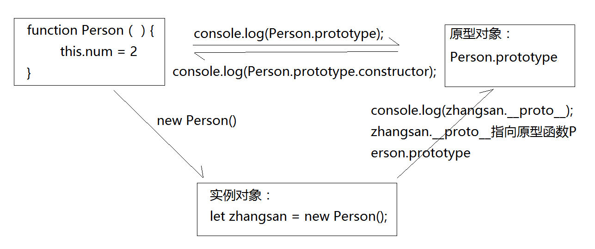
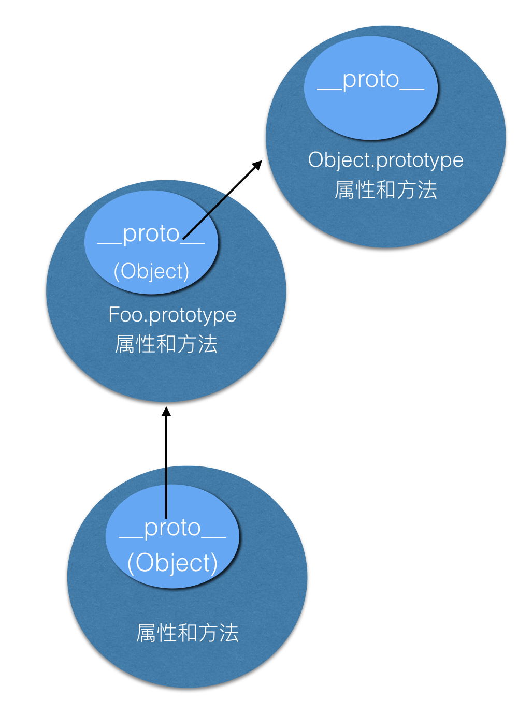
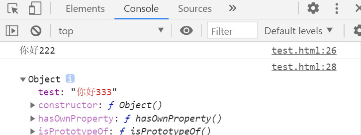
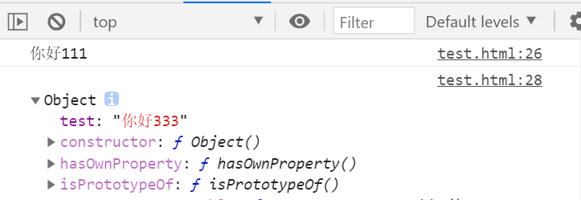
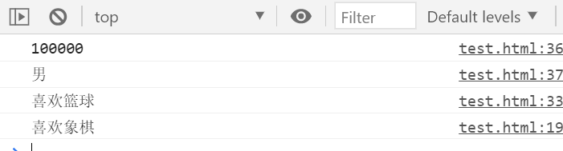
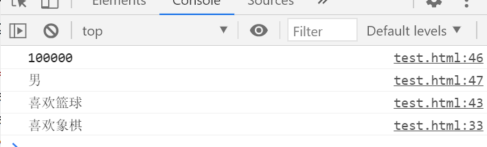

# 原型链

## 从构造函数开始

### 构造函数

在ES6之前，对象不是基于类创建的，而是用一种称为构建函数的特殊函数来定义对象和它们的特征。

构造函数是一种特殊的函数，主要用来初始化对象，即为对象成员变量赋初始值，它总与new一起使用。我们可以把对象中一些公共的属性和方法抽取出来 ，然后封装到这个函数里面。

在JS中，使用构造函数时要注意以下两点:

1. 构造函数用于创建某一类对象，约定首字母大写
2. 构造函数要和new运算符一起使用才有意义

**new在执行时会做四件事情:**

1. 创建一个空的简单 JavaScript 对象（即`{}`）；
2. 为步骤 1 新创建的对象添加属性`__proto__`，将该属性链接至构造函数的原型对象 ；
3. 将步骤 1 新创建的对象作为`this`的上下文 ；
4. 如果该函数**没有返回对象**，则返回`this`（有返回值，返回基本类型则返回this，否则返回该对象）。

```javascript
function Person(name){
    this.name = name;
    this.age =20;
    this.hobby = function(){
        console.log("喜欢篮球");
    }
}
//new实例化
let zhangsan  = new Person("张三");
let lisi  = new Person("李四");
console.log(zhangsan);
console.log(lisi);
```

### 静态/实例成员

JavaScript的构造函数中可以添加一些成员，可以在构造函数本身上添加，也可以在构造函数内部的this上添加。

* 静态成员:在构造函数本上添加的成员称为静态成员，只能由构造函数本身来访问
* 实例成员:在构造函数内部创建的对象成员称为实例成员，只能由实例化的对象来访问

```javascript
function Person(userName){
    this.userName = userName;
    this.age =20;
    this.sing = function(){
        console.log("喜欢sing");
    }
}
//new实例化
let zhangsan  = new Person("张三");

//1.实例成员就是构造函数内部通过this添加的成员userName age sing就是实例成员
//实例成员只能通过实例化的对象来访问
console.log(zhangsan.userName);
zhangsan.sing();//喜欢sing
console.dir(Person.userName);//undefined，构造函数无法访问实例成员

//2.静态成员在构造函数本身上添加的成员
Person.num = 1234;//静态成员
Person.fn = function(){
    console.dir(this);//静态方法里面的this指向构造函数
    console.log(this.num)//同时可以访问静态成员
}//静态方法
console.log(Person.num) ;//正确，打印出1234
console.log(zhangsan.num); //undefined，实例化对象无法访问静态成员
Person.fn();//this表示构造函数，数值打印1234
zhangsan.fn();//zhangsan.fn is not a function
```

### 构造函数的问题

通过构造函数创建对象：

```javascript
// 构造函数
function People(name,age) {
    this.name = name
    this.age = age
    this.show = function() {
        console.log(`姓名：${name}，年龄：${age}`)
    }
}
/*
People是一个普通的函数，这个函数的作用：构造函数
*/
let zs = new People('张三',12)
let ls = new People('李四',13)
/*
每个对象都有自己的show方法，这会很浪费资源，有100个对象就会有100个show方法
*/
console.log(zs.show ===ls.show)//false
```

重复创建多个对象，那么每个对象中的方法都会在内存中开辟新的空间，比较浪费空间

那么如何让show方法不再重复创建呢？

```javascript
function People(name,age) {
    this.name = name
    this.age = age
    this.show = fun
}
// 全局方法
function fun() {
    console.log(`姓名：${name}，年龄：${age}`)
}
let zs = new People('张三',12)
let ls = new People('李四',13)
console.log(zs.show ===ls.show)//true
function fun(){
    console.log('重复定义一个fun')
}
ls.show()//重复定义一个fun
```

将show方法移到外部，相当于show方法成了一个全局函数，然后再到Person构造函数内部去引用show方法，这样People内部的this.show都指向了同一个全局函数show，因此，我们实例化的zs和ls就实现了共享。

这种方法存在的问题是容易导致全局作用域的污染且数据是不安全的，容易被覆盖因此，我们需要了解原型。

### 构造函数继承

call，apply和bind改变this指向

```javascript
// 构造函数继承
function Dad(name,age) {
    this.name = name;
    this.age = age;
    this.money = "100000";
}
function Son(name,age) {
    // Dad.call(this,name,age);
    // Dad.apply(this,[name,age]);
    Dad.bind(this)(name,age);
    this.sex = "男";
}

let zhangsann = new Son("张三",20);
console.log( zhangsann.money);
console.log( zhangsann.sex);
```

## 原型以及对象原型


### 构造函数原型prototype

构造函数通过原型分配的函数是所有对象所共享的。JavaScript规定，每一个构造函数都有一个prototype属性，指向另一个对象。注意这个prototype本身也是一个对象，这个对象的所有属性和方法，都会被构造函数所拥有。我们可以把那些不变的方法，直接定义在prototype对象上，这样所有对象的实例就可以共享这些方法。

原型是什么?

一个对象，我们也称为prototype为原型对象。

原型的作用是什么?

共享方法。

### 对象原型

对象都会有一个属性`__proto__`指向构造函数的`prototype`原型对象，之所以我们对象可以使用构造函数`prototype`原型对象的属性和方法， 就是因为对象有`__proto__`原型的存在。

`zhangsan.__proto__ === Person.prototype`

```javascript
function Person(name){
  this.name = name;
  this.age = 20;
}
// 约定在构造函数里面写属性，在原型上追加方法
// 公共空间原型；
Person.prototype.hobby = function(){
  console.log(this.name,"喜欢篮球")
  // 原型里面的this和构造函数本身的this相同
}
Person.prototype.fn = function(){
  console.log("fn");
  console.log(this);
}
let zhangsan = new Person("张三");
let lisi = new Person("李四");

zhangsan.hobby();//调用原型的方法-张三喜欢篮球
lisi.fn();//调用原型的方法-fn

console.dir(Person);//hobby和fn方法在prototype属性里面
console.log(zhangsan.hobby===lisi.hobby);//true
```

在任何一个构造函数中都有一个prototype对象，而该prototype对象的constructor属性指向prototype对象所在函数。即：

```javascript
console.log(Person.prototype.constructor === Person) // => true
```

通过构造函数Person得到的实例对象内部会包含一个指向构造函数的 `prototype` 对象的指针 `__proto__`。

```javascript
console.log(zhangsan.__proto__===Person.prototype);
```

所以使得实例对象可以直接访问构造函数中的相关属性以及方法。

---

总结如下：

任何函数都具有一个 `prototype` 属性，该属性是一个对象。

构造函数的 `prototype` 对象默认都有一个 `constructor` 属性，指向 `prototype` 对象所在函数。

通过构造函数得到的实例对象内部会包含一个指向构造函数的 `prototype` 对象的指针 `__proto__。` 

所有实例都直接或间接继承了原型对象的成员。

构造函数、实例对象、原型对象三者之间的关系示意图：



---

原型在使用时可以去追加各种方法，但是不要在原型中直接覆盖属性， 如果在原型中直接写，会覆盖原先的constructor

错误写法：

```javascript
function Person(name){
  this.name = name;
  this.age = 20;
}
Person.prototype = {
    hobby:function(){
        console.log("hobby");
    }
}
//原型通过 constructor 指回构造函数
//constructor可以知道是由哪个构造函数创建的，知道对象的指向性问题
let zhangsan = new Person("张三");
console.log(zhangsan.__proto__===Person.prototype);//为true
console.log(zhangsan.constructor===Person);//false
console.log(Person.prototype.constructor===Person);//false
```

如果需要以上的这种方式将方法追加大量方法到原型需要将constructor指向Person

```javascript
Person.prototype = {
    constructor:Person，
    hobby:function(){
        console.log("hobby");
    }
}
```

### 原型链

为什么实例对象可以访问原型对象中的成员：

每当代码读取某个对象的某个属性时，都会执行一次搜索，目标是具有给定名字的属性。

* 搜索首先从对象实例本身开始；

- 如果在实例中找到了具有给定名字的属性，则返回该属性的值；
- 如果没有找到，则继续搜索指针指向的原型对象，在原型对象中查找具有给定名字的属性；
- 如果在原型对象中找到了这个属性，则返回该属性的值；
- 如果一直到原型链的末端还没有找到，则返回 `undefined;`

也就是说，在我们调用zhangsan.hobby()的时候，会先后执行两次搜索。

对象之间的继承关系，在JavaScript中是通过prototype对象指向父类对象，直到指向Object对象为止，这样就形成了一个原型指向的链条，称之为原型链。

1.当访问一个对象的属性或方法时，会先在对象自身上查找属性或方法是否存在，如果存在就使用对象自身的属性或方法。如果不存在就去创建对象的构造函数的原型对象中查找 ，依此类推，直到找到为止。如果到顶层对象中还找不到，则返回 undefined。

2.原型链最顶层为 Object 构造函数的 prototype 原型对象，给 Object.prototype 添加属性或方法可以被除null 和 undefined 之外的所有数据类型对象使用。


将test属性添加到Object

```js
// 构造函数
function Foo(name) {
    this.name = name;
    this.age = 20;
    //this.test = "你好111"
}
//原型对象；
Foo.prototype.fn = function () {
    console.log("f");
}
//Foo.prototype.test = "你好222";
Object.prototype.test = "你好333";

let newFoo = new Foo("张三");
console.log(newFoo.test);
//测试：依次注释111和222查看打印
console.dir(Object.prototype);
//如果执行Object.prototype.test = "你好333";那么里面就有一个test属性值为你好333
```


将test属性添加到实例化对象Foo的prototype


```javascript
// 构造函数
function Foo(name) {
    this.name = name;
    this.age = 20;
    // this.test = "你好111"
}
//原型对象；
Foo.prototype.fn = function () {
    console.log("f");
}
Foo.prototype.test = "你好222";
Object.prototype.test = "你好333";
let newFoo = new Foo("张三");
console.log(newFoo.test);
//测试：将3个你好全部关闭，或者打开部分即可
console.dir(Object.prototype);
//如果执行Object.prototype.test = "你好333";那么里面就有一个test属性值为你好333
```



将test属性添加到构造函数

```js
// 构造函数
function Foo(name) {
    this.name = name;
    this.age = 20;
    this.test = "你好111"
}
//原型对象；
Foo.prototype.fn = function () {
    console.log("f");
}
Foo.prototype.test = "你好222";
Object.prototype.test = "你好333";
let newFoo = new Foo("张三");
console.log(newFoo.test);
//测试：将3个你好全部关闭，或者打开部分即可
console.dir(Object.prototype);
//如果执行Object.prototype.test = "你好333";那么里面就有一个test属性值为你好333
```



如果都没有添加，那么就是undefined

### 原型继承

简单原型继承，出现影响父类的情况（不建议）

```javascript
// 继承
function Dad(name,age) {
    this.name = name;
    this.age = age;
    this.money = "100000";
}
Dad.prototype.fn = function(){
    console.log("fn");
}
function Son(name,age) {
    Dad.call(this,name,age);
    this.sex = "男";
}

Son.prototype = Dad.prototype;//原型继承
Son.prototype.fn = function(){
    console.log("重写的fn");
}
let zhangsan  = new Son("张三",20);
console.log( zhangsan.money);
console.log( zhangsan.sex);
zhangsan.fn();//重写的fn //继承原型后有重新方法就执行重写方法,否则执行原型的方法
let zhangyi  = new Dad("张一",50);
zhangyi.fn();//重写的fn
```


组合继承：

```javascript
function Dad(name,age) {
    this.name = name;
    this.age = age;
    this.money = "100000";
}
Dad.prototype.fn = function () {
    console.log("喜欢象棋");
}

function Son(name,age) {
    Dad.call(this,name,age);
    this.sex = "男";
}

let Link = function(){};
Link.prototype = Dad.prototype;
Son.prototype = new Link();
Son.prototype.constructor = Son;

Son.prototype.fn = function () {
    console.log("喜欢篮球");
}
let zhangsan  = new Son("张三",20);
console.log( zhangsan.money);
console.log( zhangsan.sex);
zhangsan.fn();//喜欢篮球
let zhangyi  = new Dad("张一",50);
zhangyi.fn();//喜欢象棋
```



深拷贝继承：

```javascript
function Dad(name,age) {
    this.name = name;
    this.age = age;
    this.money = "100000";
}
Dad.prototype.fn = function () {
    console.log("喜欢象棋");
}

function Son(name,age) {
    Dad.call(this,name,age);
    this.sex = "男";
}

Son.prototype =deepCopy(Dad.prototype);
Son.prototype.fn = function () {
    console.log("喜欢篮球");
}
let zhangsan  = new Son("张三",20);
console.log(zhangsan.money);
console.log(zhangsan.sex);
zhangsan.fn();//喜欢篮球
let zhangyi  = new Dad("张一",50);
zhangyi.fn();//喜欢象棋
```



## 传址传值问题

当我们在使用JS进行赋值时，进行简单类型的赋值，只会改变变量的值，而不会改变变量的地址，例如：

```javascript
// 简单数据类型：传值；新开辟内存（栈）
let a = 10;
let b = a;
b = 20;
console.log(a);
console.log(b);
```

复杂数据类型传址：

```javascript
let DadProto = {
    name:"张三"，
    age:20
}
let SonProto = DadProto;
SonProto.name = "李四";
console.log(SonProto);//{ name: "李四"， age: 20 }
console.log(DadProto);//{ name: "李四"， age: 20 }
```

大多数情况下我们都不希望这种情况发生，处理这个问题涉及到JS中的深拷贝，JS的深拷贝会为新的变量重新申请一个新的地址块，不会指向原变量的地址，如何实现深拷贝，以下提供了两种方法。

### 深拷贝

方法一：

JSON.stringify丢失方法和undefined,使用时要注意

```javascript
let DadProto1 = {
    name:"张三",
    age:20,
    fn() {
        console.log("fn..");
    },
    test:undefined
}
console.log(JSON.stringify(DadProto1));//JSON.stringify丢失方法和undefined,使用时要注意
// 将对象序列化为json字符串,再将字符串转为对象
let SonProto1 = JSON.parse(JSON.stringify(DadProto1));
SonProto1.name = "李四";
console.log(DadProto1);//{ name: "张三", age: 20, fn: fn(), test: undefined }
console.log(SonProto1);//{ name: "李四", age: 20 }
```

方法二：

```javascript
// 深拷贝
let obj = {
    name:"张三",
    age:20,
    fn:function() {
        console.log("fn..");
    },
    test:undefined,
    arr:[],
}
let obj2 = deepCopy( obj);
obj2.name = "李四";
console.log(obj2);// { name: "李四", age: 20, fn: fn(), test: undefined, arr: [] }
console.log(obj);// { name: "张三", age: 20, fn: fn(), test: undefined, arr: [] }
function deepCopy(obj) {
    let newObj = Array.isArray(obj)?[]:{}
    for (const key in obj) {
        if (Object.hasOwnProperty.call(obj, key)) {
            if(typeof obj[key] === 'object'){
                newObj[key] = deepCopy(obj[key])
            }else{
                newObj[key] = obj[key]
            }
        }
    }
    return newObj
}
```

### hasOwnProperty

`hasOwnProperty()` 方法会返回一个布尔值，指示对象自身属性中是否具有指定的属性（也就是，是否有指定的键）。

所有继承了 [`Object`](https://developer.mozilla.org/zh-CN/docs/Web/JavaScript/Reference/Global_Objects/Object) 的对象都会继承到 `hasOwnProperty` 方法。这个方法可以用来检测一个对象是否含有特定的自身属性

即使属性的值是 `null` 或 `undefined`，只要属性存在，`hasOwnProperty` 依旧会返回 `true`。

假设有以下对象，判断一些值是否存在于这个对象里

```js
let obj = {a:123}
```

使用如下的方式只能判断是否存在该属性且为真

```js
if(obj['hello']){
    console.log('obj存在hello属性')
}
```

接下来我们为Object添加hello

```js
Object.prototype.hello = 'hello'
```

使用`if(obj['hello'])`判断将为真，它会查找到原型链的最顶层的hello属性。

使用hasOwnProperty判断

```js
console.log(obj.hasOwnProperty('a'));//ture
console.log(obj.hasOwnProperty('b'));//false
```

然而当我们改写了当前对象的hasOwnProperty方法后

```js
obj['hasOwnProperty'] = ()=>true
//或者
//obj.__proto__['hasOwnProperty'] = ()=>true

console.log(obj.hasOwnProperty('a'));//ture
console.log(obj.hasOwnProperty('b'));//true
```

当前对象或原型上的hasOwnProperty被改写都可能会造成判断错误

虽然相对稳妥的判断方式是使用以下方式

```js
Object.hasOwnProperty.call(obj,'b');//false-理想结果
```

但是上面使用的

```js
obj.__proto__['hasOwnProperty'] = ()=>true
```

改变了Object.prototype.hasOwnProperty方法导致还是输出true，另外直接更改

```js
Object.prototype.hasOwnProperty = ()=>'XXX';
Object.hasOwnProperty.call(obj,'b');//XXX
```

